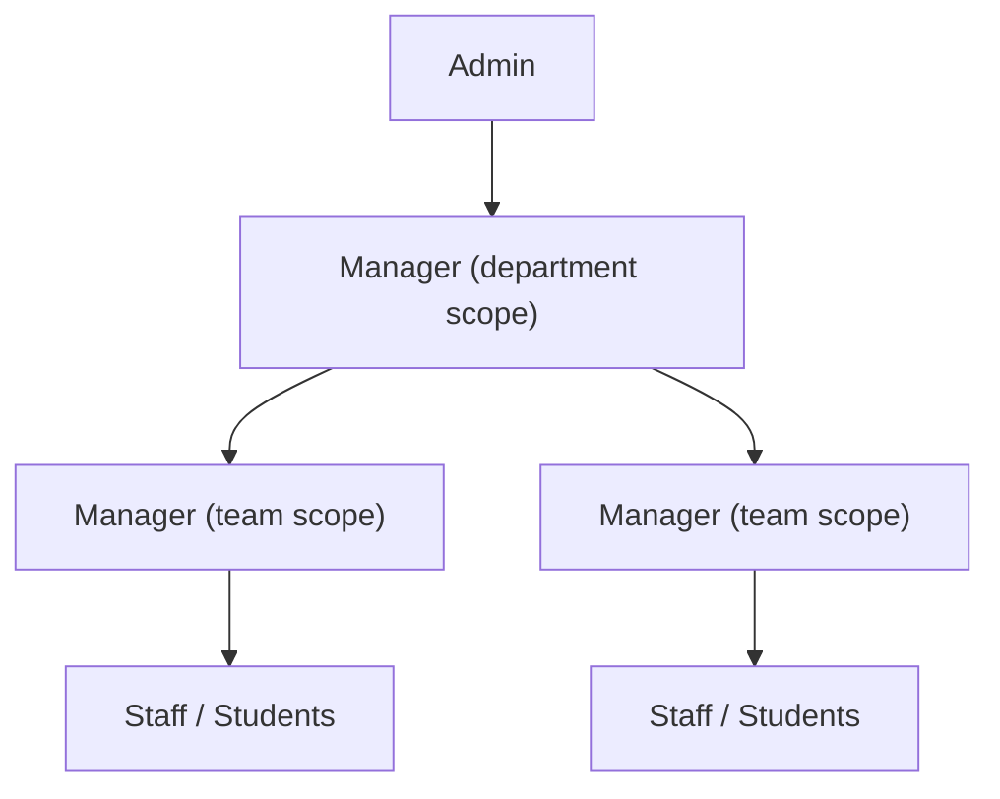

# RBAC Rework Plan

**Status**: implemented (all Phase 0 decisions locked; see [ADR 0002](adr/0002-single-manager-role-scope-as-data.md) for the decision record)
**Implements**: [ADR 0001](adr/0001-rbac-role-and-scope-rename.md) (scope-entity rename stands) and [ADR 0002](adr/0002-single-manager-role-scope-as-data.md) (single `manager` role), and the language/permission spec in [`CONTEXT.md`](../CONTEXT.md)
**Enforcement model**: rank-based `hasRole` + scope checks against `manager_id` columns

## Current state (verified in code)

- Ladder: `student < staff < manager < scheduler < admin`
- `users.roles` (TEXT[]) is the source of truth; `users.role` is a generated top-role column (`004_user_roles.sql`, `top_role()` function holds the rank array)
- Enforcement: `requireRole(minRole)` (rank) + `requireRoleIn(...)` (exact membership) in `app.go`
- Scoping: `manager` is location-scoped via `manager_assignments.location_id`; `scheduler` is department-scoped via `scheduler_assignments.department_id`; admin is global
- Worker → team membership is **job-based only**: `student_jobs → jobs → departments`. The `student_assignments (user_id, department_id, min_hours, max_hours)` table exists in `001_schema.sql` but **no backend code reads or writes it**. Multi-team membership (one worker, several teams) is already possible via multiple `student_jobs` rows; seed data just doesn't exercise it

### Touchpoint map

| Area                     | Files                                                                                                                                                                               |
| ------------------------ | ----------------------------------------------------------------------------------------------------------------------------------------------------------------------------------- |
| Role ladder + checks     | `backend/roles.go`, `roles_test.go`, `backend/cmd/set-role/main.go`                                                                                                                 |
| Route guards (~50 sites) | `backend/app.go`                                                                                                                                                                    |
| Scoping helpers + SQL    | `backend/schedule.go`, `schedule_departments.go`, `schedule_jobs.go`, `schedule_preferences.go`, `schedule_requests.go`, `schedule_workers.go`, `schedule_workqueue.go`, `audit.go` |
| User/role admin          | `backend/users.go` (`patchRole` message, `listUsers` SQL), `backend/validators.go` (`isValidRole`)                                                                                  |
| Seed                     | `backend/seed.go` (role switch, `WHERE role = ...` queries), `backend/seed/seed.csv` (role column)                                                                                  |
| Tests                    | `backend/app_test.go` (`setRole` helper, RBAC + scoping tests, expected messages)                                                                                                   |
| Frontend                 | `frontend/lib/roles.ts`, `lib/types.ts`, dashboard/manager/admin/audit pages                                                                                                        |
| Docs                     | `docs/FEATURE.md`, `docs/DATABASE.md`, `HANDOFF.md` (stale — references a migration 008 that doesn't exist)                                                                         |

## Target state

- Ladder: `student < staff < manager < admin` (single `manager` role; team vs department authority is scope, per Phase 0 #1)
- Scope vocabulary: `locations` → `departments`, `departments` → `teams` (per ADR 0001)
- Hierarchy: Department → Teams → Workers; scope lives as `manager_id` FK columns on the managed entity (no assignment side-tables)

## Phase 0 — decisions to lock

1. **Role strings** — **decided: collapse to one `manager` role**. Ladder becomes `student < staff < manager < admin`; `scheduler` disappears. Team vs Department authority is scope (`teams.manager_id` vs `departments.manager_id`), not a second role. Partially supersedes the role-naming half of ADR 0001 (the scope-entity rename stands); `CONTEXT.md`'s Language section needs updating in Phase 4.
2. **Assignment tables** — **decided: delete all three** (`manager_assignments`, `scheduler_assignments`, `student_assignments`). Scope becomes FK columns on the managed entity: `departments.manager_id` (Department Manager), `teams.manager_id` (Team Manager). A manager can hold many teams/departments (rows point at them); a team/department has exactly one manager — no co-managers unless a need shows up.
3. **Migration strategy** — **decided: greenfield wipe**. No ALTER/RENAME migration is written. Schema files are edited in place to the new names; dev DBs are reset with `manage.sh` → 9 (drops and recreates the schema; `schema_migrations` goes with it, so all migrations re-apply from scratch). Caveat: editing a migration in place does nothing to a DB that already recorded versions 1–4 — the wipe is what makes the edits take effect.
4. **API JSON keys** — **decided: rename** (`locationId` → `departmentId`, `departmentId` → `teamId`) so the wire format matches the new vocabulary. Touchpoints: Go `json:` tags + response maps (`schedule_departments.go`, `schedule_jobs.go`, workqueue), `lib/types.ts`, form field names + request bodies in admin/manager pages, `JobModal`.
5. **Worker → Team membership** — **decided: `worker_teams` join table** (multi-team stands: Worker A in Help Desk + Lab Support + IT Support). Shape: `worker_teams (user_id → users.id, team_id → teams.id, active)` with UNIQUE `(user_id, team_id)`. `Worker` is **not** a separate table: workers log in (calendar, requests), so they stay `users` rows — the sketch's name/email/`worker_type` fields already live on `users`/`user_profiles`. Jobs (`student_jobs`) stay the work-function layer; hour caps stay per-job. **Behavior change**: worker visibility (`listStudents` etc.) resolves from `worker_teams` membership instead of job rows, so a worker with no active job is now visible to their team's manager.
6. **Postgres schema namespace** — **decided: rename `public` → `scheduling`**. All objects (tables, `schema_migrations`) live in a named schema instead of the default. Cheap now, nicer than `public`, and independent of the database name (docker-compose already defaults `POSTGRES_DB` to `scheduling`).
7. **HR Functions branch** — **decided: dropped**. No HR role and no per-user capability flag; approvals stay part of what a manager already does (`hr.approve` in the spec). The HR branch is removed from the org chart. Revisit only if a real HR-only workflow appears.
8. **Reports-to (leaning no)** — `users.manager_id` is derivable (team manager → team → department → its manager); add only if a real workflow needs an explicit reporting line.

## Phase 1 — schema (rewrite, not migrate)

No ALTER/RENAME statements — schema files are rewritten with final names and the DB is rebuilt from scratch (`manage.sh` → 9). The old rename-order collision concern is gone.

### Schema namespace: `public` → `scheduling`

- **Migration runner self-heal**: `migrate()` in `main.go` and `ensureTestSchema()` in `app_test.go` get a leading `CREATE SCHEMA IF NOT EXISTS scheduling;` before creating `schema_migrations` — otherwise a fresh boot with a search_path pointing at a nonexistent schema fails with "no schema has been selected"
- **DSN defaults gain `search_path=scheduling`**: `backend/app.go` `loadConfig` fallback, `backend/cmd/set-role/main.go` `defaultDatabaseURL`, `manage.sh` `load_db_url` fallback, `docker-compose.yml` backend `DATABASE_URL`, `.env.example` template. pgx passes unknown URI params as runtime params, so `?sslmode=disable&search_path=scheduling` works; fallback form if needed: `options=-c search_path=scheduling`
- **`manage.sh`** `reset_database()` + `re_seed()`: `DROP SCHEMA public CASCADE; CREATE SCHEMA public;` → target `scheduling`. Kept as explicit schema-qualified SQL rather than a URI param — libpq (psql) rejects `search_path=` as a URI keyword
- **Test URL convention**: `TEST_DATABASE_URL` examples in `app_test.go` header, `docs/DATABASE.md`, README — append `search_path=scheduling`
- **User-private config**: `.env` / `.env.dev` / `.env.docker` are not in-repo-readable; the `DATABASE_URL` in each needs `search_path=scheduling` appended manually (or a fresh wipe re-creates everything under the new default)
- **Docs**: `DEPLOYMENT.md` + `DOCKER.md` `DATABASE_URL` examples

### Tables (proposed shape)

- `users` — identity + auth, born in final shape: `roles TEXT[]` source of truth + generated `role` top-role column (rank array `student, staff, manager, admin`, folding in what `004` does today); keeps `worker_type`/`hourly_limit`/`disabled`
- `departments` (was `locations`) — `id, name, ..., manager_id → users.id`
- `teams` (was `departments`) — `id, department_id → departments.id, name, description, active, manager_id → users.id`
- Worker membership: `worker_teams (user_id → users.id, team_id → teams.id, active)`, UNIQUE `(user_id, team_id)` (Phase 0 #5)
- `jobs` → `team_id`, `workqueue` → `team_id`, `student_jobs` unchanged (hour caps), `audit_log.department_id` → `team_id`
- Roles stay on `users.roles` as the ladder/enforcement source; `manager_id` columns are scope pointers only — a user holding `manager` with no team/department pointing at them has the role but no scope
- `seed/seed.csv` role values updated (`scheduler` rows become `manager`; role list shrinks to student/staff/manager/admin); seeds assign managers via the new `manager_id` columns
- Optional cleanup: collapse migrations 002–004 into `001` and trim the version lists in `main.go` + `app_test.go` to a single entry — cleanest for greenfield, slightly bigger diff

## Phase 2 — backend rename (mechanical but wide)

- `roles.go` ladder + `roles_test.go`
- `app.go` route guards: every `requireRole("manager")` and `requireRole("scheduler")` → `requireRole("manager")`; `requireRoleIn("manager","admin")` gates (jobs, workers, AI chat) collapse to `requireRole("manager")` — `requireRoleIn` likely becomes unused
- **New scope guards where rank used to separate team- vs department-level authority** (a team-scoped manager passes the rank now): department create/update, job create/update, worker create — gate on `EXISTS (SELECT 1 FROM departments WHERE manager_id = caller)` (admin bypasses)
- Behavior change: shift assignment (`assignWorkqueueShift`, previously scheduler-rank-only) opens to all managers within scope — department managers can assign in their own departments again
- Scoping helpers become FK lookups (assignment tables are gone): team scope = `SELECT id FROM teams WHERE manager_id = $1`; department scope = `SELECT id FROM departments WHERE manager_id = $1`. Note these return **sets** now (one manager may hold many rows), so the helpers change from single-ID to lists; update every caller in `schedule_*.go` + `audit.go` (the `hasAnyRole(u.Roles, "scheduler")` team-vs-department branches become scope checks: does the caller manage departments, or only teams?)
- `users.go`: `patchRole` valid-role list + error message, `listUsers` SQL literals (`role <> 'admin'`, `role IN ('student','staff')`), `createWorker` (still student/staff only — no escalation path change; now also writes the worker's `worker_teams` row)
- `validators.go` `isValidRole`
- `cmd/set-role/main.go` roles list
- `seed.go`: role switch cases, `WHERE role = ...` queries; manager/scheduler assignment inserts become `manager_id` updates on `departments`/`teams`; worker membership seeds into `worker_teams`
- Worker-visibility queries (`listStudents`, `workerPreferences`, request scoping, …) switch their `EXISTS` joins from `student_jobs`/`jobs` to `worker_teams` where the question is membership rather than job fit — job-scoped checks (e.g. `assignStudentJob`, `createWorker`'s job-location check) keep their job joins
- Tests: `setRole` values, `TestUsersRBAC`, `TestPatchRoleInvalidValue` message (now `student, staff, manager, admin`), scoping tests for team-scoped vs department-scoped managers

## Phase 3 — frontend

- `lib/roles.ts`: `ROLES` array (admin-page role checkboxes follow automatically)
- Dashboard: role-based routing (`manager`/`scheduler` → `/manager`, etc.)
- Manager page: `canAssign` — all managers now pass rank (server-side scope does the limiting); `canManageJobs` stays a UI hint backed by the new department-scope guard; `me.user.role !==` gates; hint text ("your department" → "your team"); "Team/Department Manager" labels become scope-derived or just "Manager"
- Audit page: role gates
- `lib/types.ts` + pages: API field renames per Phase 0 #4
- Add Worker select stays `student`/`staff` only

## Phase 4 — docs + validation

- Update `docs/FEATURE.md`, `docs/DATABASE.md`, `HANDOFF.md`
- Update `CONTEXT.md`: Language section (role ladder, Team/Department Manager entries → single Manager with scope note) and the permission-spec table (Team/Dept Manager columns collapse into scope-conditioned `manager` rows)
- Consider a short ADR 0002 documenting the single-`manager` collapse and what it supersedes in ADR 0001
- Validation: `go test ./...` (backend integration tests need Postgres), frontend build, manual smoke across all five role logins (role-gated pages + scoping)

## Explicitly out of scope

- Replacing rank checks with a permission-table enforcement system (`CONTEXT.md`: the permission spec is documentation, enforcement stays `hasRole` + scope checks)
- Per-user capability flag for managers who shouldn't schedule/approve (`CONTEXT.md`: deferred until a real case exists)

## Outcome

Implemented across backend, frontend, seed, tests, and docs. Validation: `go build` + `go vet` + full integration suite (`go test ./...` against a live Postgres, `TEST_DATABASE_URL` with `search_path=scheduling`) all pass; seed boots clean against a fresh database (43 users, 10 managers assigned via `manager_id`, 61 `worker_teams` rows, 434 shifts); `npm run build` passes (19/19 pages).

Deviations worth knowing:

- `seed.csv` keeps the legacy `scheduler@…` email addresses and `scheduler` role values; `seed.go` maps them to team-scoped managers (accounts are identifiers, not permissions)
- `teams` uniqueness is per-department `UNIQUE (department_id, name)` (the old `departments` table had a global unique name)
- `PATCH /api/teams/{id}/manager` exists on the backend but the admin Teams tab has no manager picker yet (the departments-tab picker was rewired to `PATCH /api/departments/{id}/manager`)
- The coverage-calendar page route moved `/scheduler/calendar` → `/calendar`
- User-private `.env` / `.env.dev` / `.env.docker` need `search_path=scheduling` appended to their `DATABASE_URL` by hand
- Migration 002–004 were folded into the rewritten `001_schema.sql`; the runner lists in `main.go` and `app_test.go` carry a single version
